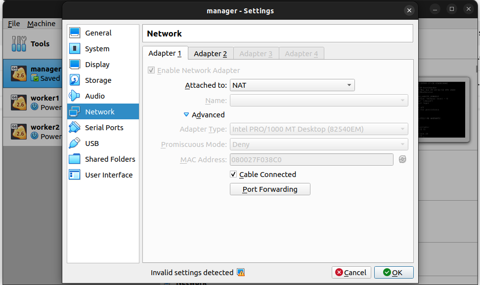
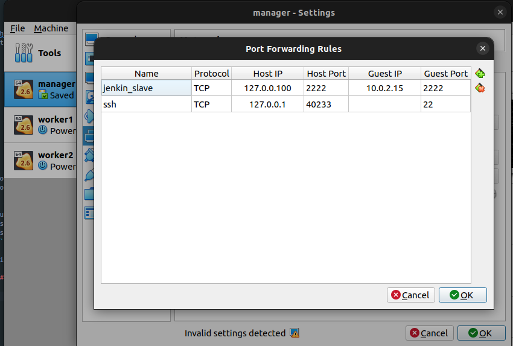
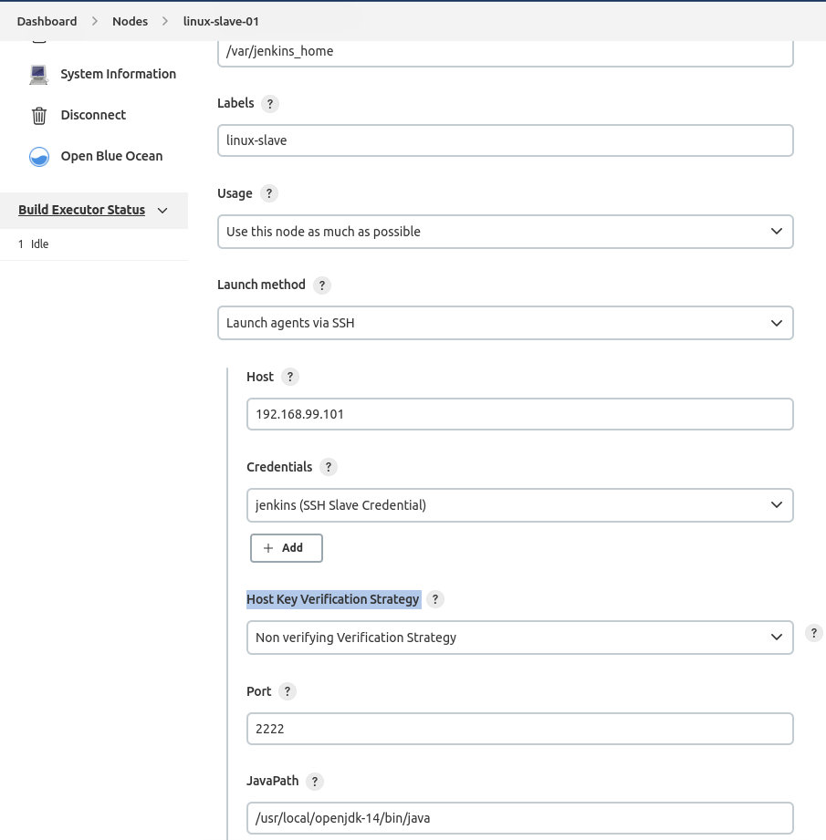

# Jenkins Architecture - Task 1  


Trong task này, bạn được yêu cầu tạo 1 Jenkins Slave container, sau đó add Jenkins slave này vào Jenkins master sử dụng SSH protocol.  

## 1. Tạo Jenkins Slave container

### 1.1 Copy [install_jenkins_slave.sh](./scripts/install_jenkins_slave.sh) to virtual host

> Exec tại virtual host

```
# Tạo thư mục 2_jenkins-slave/scripts tại home
mkdir -p /home/2_jenkins-slave/scripts/
```

> Exec tại local

```
# copy install_jenkins_slave.sh to virtual host
docker-machine scp install_jenkins_slave.sh manager:/home/2_jenkins-slave/scripts
```

### 1.2. Sửa install script để run Jenkins Slave

- Tạo cặp keypair để cho **Jenkins Master** có thể kết nối được tới **Jenkins Slave** qua **SSH**

> Exec tại virtual host

```
# Di chuyển tới thư mục của Hands-on
cd /home/2_jenkins-slave/scripts

# Sinh ssh keypair và lưu tại thư mực đang làm việc
# Enter khi được yêu cầu 'Enter file in which to save the key'
ssh-keygen -t rsa

## Nếu không copy được vào thư mục cd /home/docker/.ssh
cd /home/docker/.ssh
cp -v id_rsa.pub id_rsa authorized_keys /home/2_jenkins-slave/scripts/
cd /home/2_jenkins-slave/scripts/

# kiểm tra file rsa và xem phân quyền
alias ll='ls -al'
ll

# Change mode private key
sudo chmod 400 id_rsa

# Chạy script để tạo cài đặt Jenkins Slave
sudo bash ./install_jenkins_slave.sh
```

### 1.3. Kiểm tra trạng thái của Jenkins Slave Container  

```/bin/bash
# Tại host cài đặt Jenkins Slave container
# Kiếm tra Container đã chạy thành công hay chưa
docker ps

# Kiểm tra kết nối ssh tới Jenkins Slave container
ssh -i id_rsa jenkins@localhost -p2222

# Thoát khỏi Jenkins Slave Ctrl + D
# Trong trường hợp connection bị denied thì xóa file known_hosts đi
rm ~/.ssh/known_hosts

# lấy IP của Node mà Jenkins Slave đang chạy trên đó
ifconfig
# Ví dụ kết quả thu được 10.0.2.15 với output của ifconfig
eth0      Link encap:Ethernet  HWaddr 08:00:27:F0:38:C0  
          inet addr:10.0.2.15  Bcast:10.0.2.255  Mask:255.255.255.0
          inet6 addr: fe80::a00:27ff:fef0:38c0/64 Scope:Link
          UP BROADCAST RUNNING MULTICAST  MTU:1500  Metric:1
          RX packets:1934 errors:0 dropped:0 overruns:0 frame:0
          TX packets:1417 errors:0 dropped:0 overruns:0 carrier:0
          collisions:0 txqueuelen:1000 
          RX bytes:188942 (184.5 KiB)  TX bytes:221153 (215.9 KiB)

eth1      Link encap:Ethernet  HWaddr 08:00:27:71:90:F4  
          inet addr:192.168.99.101  Bcast:192.168.99.255  Mask:255.255.255.0
          inet6 addr: fe80::a00:27ff:fe71:90f4/64 Scope:Link
          UP BROADCAST RUNNING MULTICAST  MTU:1500  Metric:1
          RX packets:23529 errors:0 dropped:0 overruns:0 frame:0
          TX packets:4824 errors:0 dropped:0 overruns:0 carrier:0
          collisions:0 txqueuelen:1000 
          RX bytes:22676669 (21.6 MiB)  TX bytes:4450546 (4.2 MiB)
```

```/bin/bash
# Tại host chạy Jenkins Master container
# Tạo thư mục .ssh trên
mkdir -p /var/jenkins_home/.ssh

# Add Jenkins Slave là trusted servers trên Jenkins Master, 
# trong ví dụ này, jenkins_slave_node_ip = 10.0.2.15
ssh-keyscan -p2222 <jenkins_slave_node_ip> > /var/jenkins_home/.ssh/known_hosts
as ->
ssh-keyscan -p2222 10.0.2.15 > /var/jenkins_home/.ssh/known_hosts
```

```
# Cấp quyền thực thi cho Docker daemon socket
sudo chmod 666 /var/run/docker.sock
```

## 2. Thêm Jenkins Slave node trên Jenkins Master

### 2.1. Cài đặt SSH Credential

- Vào **Manage Jenkins** => **Manage Credentials** => Click **(global)** => **Add Credentials** . Chọn **Kind** là **SSH Username vs Private Key**.
- Chọn Username là **jenkins**
- Điền ID: **ssh_slave_credentail**
- Phần Private Key copy nội dung của file **id_rsa** được gen ở bước **1.2**
- Ấn nút **Create**


### 2.2. Add Jenkins Slave Node

- Vào **Manage Jenkins** => **Manage Nodes and Cloud** => **New Node** => điền giá trị Node name **linux-slave-01** => ấn Create và tự động chuyển hướng tới cấu hình Slave


- Điền thông tin theo của Slave Container

| Field | Giá trị  | Ý nghĩa|
|--|--|--|
| Name | linux-slave-01 | Tên của Node|
| Number of executors | 1 | Mỗi Executor sẽ chạy được 1 Job|
| Remote root directory | /var/jenkins_home | Remote root|
| Labels| linux-slave | Nhãn để lựa chọn Node build sau này|
| Usage| Use this node as much as possible | Use this node possible |
| Launch method| Launch agents via SSH |Sử dụng SSH để kết nối tới Slave|
| Host| <jenkins_slave_node_ip> | IP của slave node để Master kết nối SSH tới|
| Credential | ssh_slave_credential | SSH private key và User đã tạo ở  phần 2.1 |
| Host Key Verification Strategy | Non verifying Verification Strategy | Host key |
| Advanced -> Port | 2222 | SSH Port |
| JavaPath| /usr/local/openjdk-14/bin/java | Đường dẫn tới Java Binary |


- Save thông tin và kiểm tra trạng thái của Slave


**Task #1 Completed**

## 3. Trouble Shooting

### 3.1 Đồng bộ thời gian giữa các node

### 3.2 Chạy Jenkins Master trên node vật lý & Jenkins Slave trên docker

```
Trên Node Master, switch tới user jenkins và tạo cặp khóa rsa
$ su - jenkins
$ ssh-keygen 
# enter -> enter theo các giá trị mặc định

Thoát khỏi jeknins user, trở lại user root 
Ctrl + D

# Tạo thư mục jenkins home cho slave
$ mkdir -p /var/jenkins_home_slave/.ssh

# Copy id_rsa.pub vào thư mục .ssh của jenkins_home của slave
# (Nếu server jenkins master không chạy cùng jenkins slave thì phải copy file từ node master sang slave)
$ cp /var/lib/jenkins/.ssh/id_rsa.pub /var/jenkins_home_slave/.ssh/authorized_keys

# Thay đổi permission và owner của các file và folder
$ chmod 700 /var/jenkins_home_slave/.ssh
$ chmod 600 /var/jenkins_home_slave/.ssh/authorized_keys
$ chown -R 1000:1000 /var/jenkins_home_slave

# Cài đặt Jenkins trên docker
docker run -p 2222:22 -v /var/jenkins_home_slave:/var/jenkins_home -v /var/run/docker.sock:/var/run/docker.sock --restart always -d --name jenkins-slave hoangphu98/jenkins-slave:latest

# Trên node Master, Switch tới user jenkins và thực hiện test và thêm known_hosts
su - jenkins
ssh -i id_rsa jenkins@<slave_node_ip>  -p2222
ssh-keyscan -p2222 <slave_node_ip> > /var/lib/jenkins/.ssh/known_hosts
```

Tiếp tục làm  **2. Thêm Jenkins Slave node trên Jenkins Master**

### 3.3 [Port forward from virtualbox to local](https://www.youtube.com/watch?v=Kq_JOGX0MW4)

> 3.3.1 Forward port when **jenkin-server** run on local and **jenkin-slave** run on host virtual-machine, which is difference network

```jenkins-server
CONTAINER ID   IMAGE                   COMMAND                  CREATED          STATUS          PORTS                                                                                      NAMES
099b9099572a   jenkins/jenkins:2.356   "/usr/bin/tini -- /u…"   37 minutes ago   Up 37 minutes   0.0.0.0:8080->8080/tcp, :::8080->8080/tcp, 0.0.0.0:50000->50000/tcp, :::50000->50000/tcp   jenkins-server
```

```jenkins-slave
CONTAINER ID        IMAGE                             COMMAND             CREATED             STATUS              PORTS                  NAMES
3cdee247da3b        hoangphu98/jenkins-slave:latest   "/entrypoint.sh"    49 minutes ago      Up 49 minutes       0.0.0.0:2222->22/tcp   jenkins-slave
```





`
Open virtualbox -> Select host -> Settings -> Network -> Adapter (NAT) -> Port Forwarding -> Add new port forward -> Ok
`

> 3.3.2 Update config **Host and Host Key Verification Strategy** in **Manage nodes and clouds**



`
Host Key Verification Strategy -> Select **Non verifying Verification Strategy**
`

> docker-machine ls

```
NAME      ACTIVE   DRIVER       STATE     URL                         SWARM   DOCKER      ERRORS
manager   -        virtualbox   Running   tcp://192.168.99.101:2376           v19.03.12   
worker1   -        virtualbox   Stopped                                       Unknown     
worker2   -        virtualbox   Stopped                                       Unknown 
```

`
Host -> Add Host was config at port forward as 192.168.99.101 instead of 10.0.2.15
`
