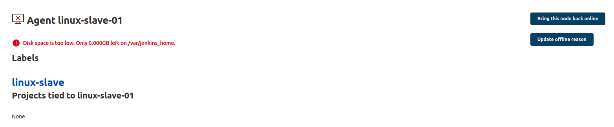
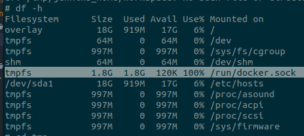
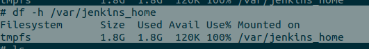
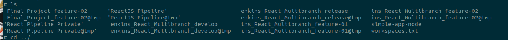

  
  
# Task #1 - Final Project

Trong task này, bạn cần sử dụng tổng hợp các kiến thức đã học để xây dựng một Multibranch Pipeline đáp ứng mô hình sau:

- Source code ReactJS sử dụng cho task: <https://github.com/HoangPhu98/react-for-demo>
- Xây dựng Multibranch Pipeline, có webhook từ GitHub, workflow như sau
  - Nhánh `feature.*` có tích hợp code: chạy test và quét code tĩnh với SonarQube
  - Nhánh `develop` cho phép build và deploy ứng dụng tới môi trường DEV
  - Nhánh `release` cho phép build và deploy ứng dụng tới môi trường STG
  - Tag tạo từ nhánh `release` được sử dụng cho build và deploy ứng dụng tới môi trường PRD


- Pipeline sẽ chạy trên các nhánh và tag theo luồng sau


- Sử dụng docker để build image và upload image lên Docker Hub.
- Thêm stage deploy ứng dụng trên agent:
  - Deploy bằng docker trên agent
  - Sử dụng [tham số](https://itnext.io/jenkins-tutorial-part-3-parameterized-pipeline-3898643ac6ad) để tham số hóa các giá trị `host port` khi deploy bằng docker
- Sử dụng tag để deploy lên môi trường Production
- Sử dụng Blue Ocean để theo dõi kết quả

## Một số gợi ý

**Filter by name(Regex) trong Jenkins Multibranch Pipeline**:

```config
(develop|release.*|feature.*|^v(\d+(?:\.\d+)*)$)
```

**Stage Parallel: Check code quality và Run test**

```config
stage ('Integration Code') {
      parallel {
        stage ('Code Quality') {
          stages {
            stage('Code Quality Check') {
              agent {
                docker {
                  image 'gradle:jdk8-alpine'
                  label 'linux-slave'
                }
              }

              steps {
                script{
                  def scannerHome = tool 'sonar_scanner';
                  withSonarQubeEnv('sonar') {
                      sh "${scannerHome}/bin/sonar-scanner \
                          -Dsonar.projectKey=color-app \
                          -Dsonar.projectName=color-app \
                          -Dsonar.host.url=${SONAR_HOST_URL}"
                  }
                }
              }
            }
            stage("Quality gate") {
              steps {
                waitForQualityGate abortPipeline: true
              }
            }
          }
        }

        stage ('Code Testing') {
          stages {
            stage ('Install Dependencies') {
              tools {
                nodejs 'nodejs 8.9.4'
              }
              steps {
                sh '''
                  echo "Installing..."
                  npm install
                  echo "Install dependencies successfully."
                  ls -al
                '''
              }
            }
            stage ('Test') {
              tools {
                nodejs 'nodejs 8.9.4'
              }
              steps {
                sh 'echo "Run unit test..."'
                sh 'npm test'
                sh 'echo "Run unit test successfully."'
                sh 'ls -al'
              }
            }
          }
        }
      }
    }
```

**Build stage**:

- Lựa nhánh: chỉ có nhánh `develop`, `release` và tag có định dạng `v<number>.<number>.<number>` được phép build code.

```config
      when {
        anyOf {
            branch 'develop'
            branch 'release'
            tag pattern: "^v(\\d+(?:\\.\\d+)*)\$", comparator: "REGEXP"
        }
      }
```

**Deploy stage**:

- Deploy cho nhánh `develop`, `release` và **tag**.

```config
      steps {
        sh '''
          docker stop color-app-dev || true && docker rm color-app-dev || true
          docker run -p <host_port>:80 --restart always -d --name color-app-dev ${DOCKER_REGISTRY_NAME}/pick-color:${BRANCH_NAME}-${BUILD_NUMBER} 
        '''
      }
```

- Đảm bảo các tham số sau đây:

| Branch/Tag        | Environment | Image tag                      | Ví dụ image tag | Host port  |
|-------------------|-------------|--------------------------------|-----------------|------------|
| branch: `develop` | Dev         | develop-<build_number>         | develop-10      | 30080      |
| branch: `release` | Stg         | stg-<build_number>             | stg-6           | 30090      |
| `tag`             | Prd         | v\<number>.\<number>.\<number> | v1.0.1          | 30100      |

## Kết quả

...

## Trouble Shooting

### Jenkins **Disk space is too low**



> Exec to container **Jenkins-slave**

```
docker exec it <jenkins_slave_container_id> sh

df -h
```



Or



> ## Manual Clean workspace

but not clear **workspaces.txt**

[Read more](https://stackoverflow.com/questions/10325982/how-to-solve-jenkins-disk-space-is-too-low-issue/42220105#42220105)

```
docker exec it <jenkins_slave_container_id> sh

cd /var/jenkins_home/workspace

rm -rf folder_build

ls

exit
```



> ## Auto clean workspace with [Workspace Cleanup](https://plugins.jenkins.io/ws-cleanup/)

Vào  **Manage Jenkins** => **Plugin Manager**  tìm tới phần **Available** => Add **Workspace Cleanup** chọn **Install without restart**.

### Setup jenkins file include options

```
options {
  // This is required if you want to clean before build
  skipDefaultCheckout(true)
}
```

```
stage ('Clear old build') {
    steps {
      // Clean before build
      cleanWs()
      // We need to explicitly checkout from SCM here
      checkout scm
      echo "Clean before build done!!!"
    }
  }
}
```

```
post {
  // Clean after build
  always {
    cleanWs(cleanWhenNotBuilt: false,
            deleteDirs: true,
            disableDeferredWipeout: true,
            notFailBuild: true,
            patterns: [[pattern: '.gitignore', type: 'INCLUDE'],
                        [pattern: '.propsfile', type: 'EXCLUDE']])
  }
}
```
